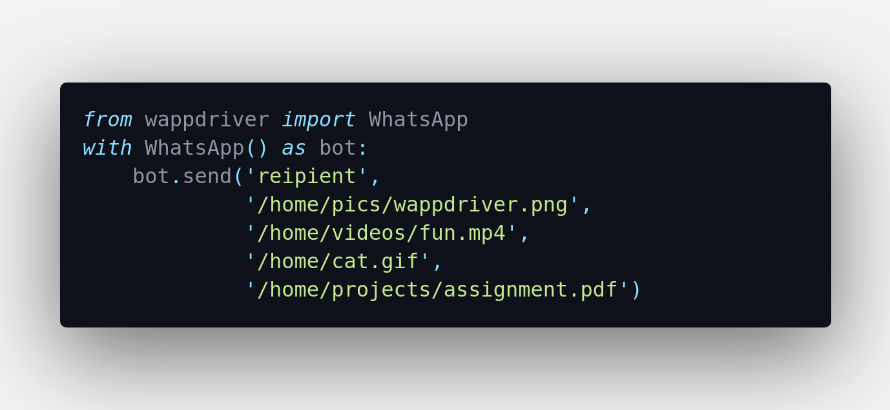

# Usage Documentation


This is a detailed usage documentation for using `wappdriver`. [README](https://aahnik.github.io/wappdriver) for introduction. 


## First time Setup

There is no hassle in setting up `wappdriver`.
>Make sure you have matching versions of Chrome and Chrome Driver.
After you `pip install wappdriver`, you can directly run your code. 
- You will be prompted to enter the installation path of Chrome Driver Executable (only once). Just copy and paste the correct path there. 
- When you load WhatsApp for the first time, you have to scan the QR Code that will be displayed on your computer from your phone, to login into WhatsApp Web

## Sending Messages
#### Sending a Simple Message

The code snippet below is enough to show you how.

.

#### Messages with bold, italics and strike-through

To send formatted text, use the same techniques you use while typing on your smartphone. 
Simply enclose the words with special characters as shown
```
*bold*
_italics_
-strike-
```


#### Sending Emojis 

To send an emoji simply copy it from internet and paste it in your message string.

Here are some commonly used emojis

🙄 😂 😫 🤔 🔥  😌 😍 🤣 ❤️ 😭 😂 🙏 💕 💜 👉

#### Sending to Multiple People

You can easily send a message to multiple people

```python
from wappdriver import WhatsApp

recipients = ['friend','mom','dad', 'boss', 'client']

with WhatsApp() as bot:
    for person in recipients:
        bot.send(person, f'hi {person} send by a bot')
```

## Sending files
#### Images, Videos and Documents

With `wappdriver` its easy to do all these. Simply pass the path of the image or video or document file to the `send` method. 
- You must use absoulte file paths.
- File path must not have any space 
  
Note: 
- In Windows absolute paths looks like: 
    `C:\Users\mathew\img.png`
- While in Linux or Mac they look like:
    `/home/aahnik/img.png`

You can send any file type that WhatsApp supports.
> WhatsApp does not support files over 16 MB


#### Sending Multiple Files 

You can easily pass as many arguments to `send` method of `WhatsApp` class you wish.
**Just remember that the first argument must be the name of the recipient.**




#### Messages with Files

Hmm! `wappdriver` is extremely smart. It can detect whether a string is a message or a file path. So you can do this as shown below. Dont hesitate to use a multiline line string for a long message. 


The messages will be send in exactly that order.

## Tired bot

If your computer or internet is very slow, you may face timeout exceptions, or messages not being sent properly. In this case we call our bot exhausted or tired.
 
You can solve this by overriding the default timeout value.This can be done by passing an optional argument to the `WhatsApp` context manager.

```python
from wappdriver import WhatsApp

with WhatsApp(timeout=100) as bot:
    bot.send('aahnik',  'Exhausted ?')
```
The default value of timeout is 50s ( when you dont pass the argument)

If bot is exhausted, increase timeout.


## Update Variables 

When you run `wappdriver` for the first time, the values of selectors is fetched from the internet.

If you want to update them
```python
from wappdriver import update_vars
update_vars()
```
If any new updates are availaible, they will be downloaded.


## Set Chrome Driver Path

When you will use `wappdriver` for the first time, it will ask you to input the path of Chrome Driver Executable in your system.

You can set the path programmatically 
```python
from wappdriver import set_chrome_driver_path
path = '/home/aahnik/Downloads/chrome_driver' 
set_chrome_driver_path(path)
```

**Replace the value of variable `path` with the path of chrome driver in your system.**


## In Brief

Pass name of recipient as first argument and after that you can pass as many message arguments as you wish. 

- The name of recipient must be saved in your contacts.
- Each message argument must be a string. 
- If you want to send a file, pass the absolute path of the file to the function.
        
---
Example Use:

```python

with WhatsApp() as bot:
    bot.send('aahnik',  # name of recipient

            'hi send by a bot',  # message

            # absolute path of an image on computer
            '/home/aahnik/image.png',  

            # absolute path of a video on computer
            '/home/aahnik/video.mp4',  

            # absolute path of pdf on computer
            '/home/aahnik/django.pdf'  
            )
```


The first argument you need to pass is the recipient's name which must be saved in your phone.

After that you can pass as many string arguments you want for message. 
The string can be:
- a text message or 
- the file path if you want to send a image, video, GIF, documents etc.
- you can send multiple files, just pass them as arguments
- You must use Absolute File Paths
  
`wappdriver` will automatically detect whether a string is a message or a file path.

---

**If you are a developer and want to contribute code, read [Developer Guide]()**